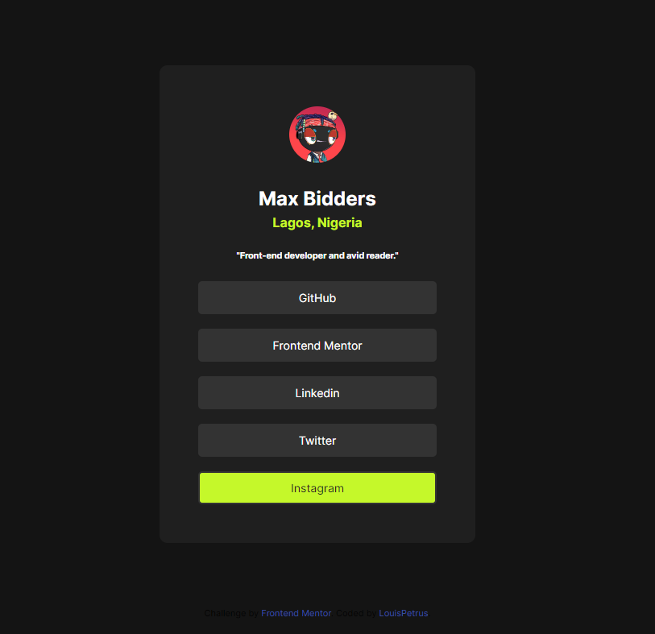

# Frontend Mentor - Social links profile solution

This is a solution to the [Social links profile challenge on Frontend Mentor](https://www.frontendmentor.io/challenges/social-links-profile-UG32l9m6dQ). Frontend Mentor challenges help you improve your coding skills by building realistic projects. 

## Table of contents

- [Overview](#overview)
  - [The challenge](#the-challenge)
  - [Screenshot](#screenshot)
  - [Links](#links)
- [My process](#my-process)
  - [Built with](#built-with)
  - [What I learned](#what-i-learned)
  - [Continued development](#continued-development)
  - [Useful resources](#useful-resources)
- [Author](#author)
- [Acknowledgments](#acknowledgments)


## Overview

social-links-profile-main

### The challenge

Users should be able to:

- See hover and focus states for all interactive elements on the page

### Screenshot

 

### Links

- Solution URL: [Add solution URL here](https://your-solution-url.com)
- Live Site URL: (https://social-links-profile-main-sigma-five.vercel.app/)

## My process

I started by coloring the body background and gave it the styling tags that will make it mobile responsive. I then went ahead to create a block for my design using the div tag. I colored the div background, imported the image, then styled the texts and gave them the heading and paragraph tags. I then made my link paragraphs hover responsive.

### Built with

- Semantic HTML5 markup
- CSS custom properties
- Flexbox
- CSS Grid

### What I learned

Changing the hover text color works on links if the cursor pointer is on the link text and not and the page background.

```html
<h1>Some HTML code I'm proud of</h1>
<div class="content">The class attribute</div>
```
```css
.proud-of-this-css {
  color: papayawhip;
}
p:hover {    
    color: hsl(0, 0%, 12%);
    background-color: hsl(75, 94%, 57%);
    text-decoration: none;
}
```

### Continued development

I will continue practicing on using the color changing hover attribute. I really like that feature.

## Author

- Frontend Mentor - [@MaxBidder76](https://www.frontendmentor.io/profile/MaxBidder76)

## Acknowledgments

Thanking God for the success of this challenge.
